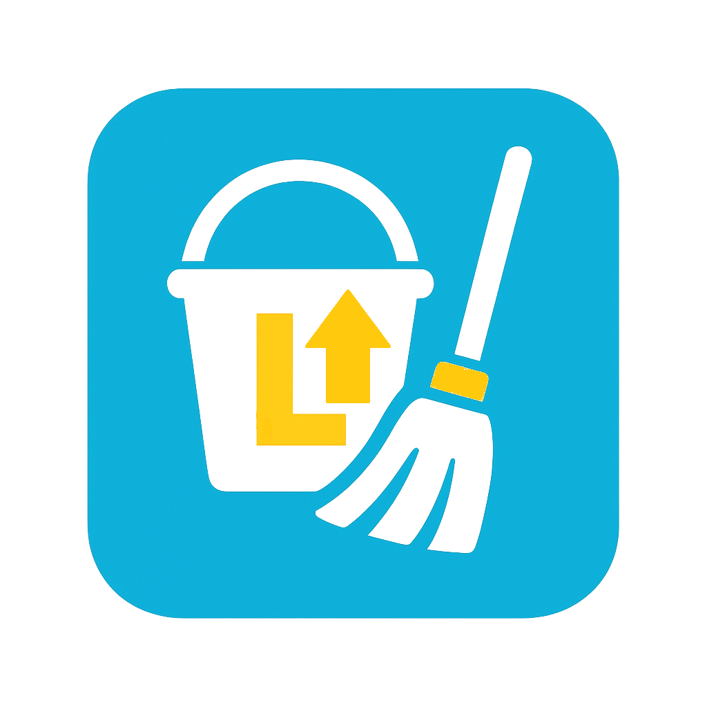

<!DOCTYPE html>
<html lang="pt-br">
<head>
<meta charset="UTF-8">
<meta name="viewport" content="width=device-width, initial-scale=1.0">
<meta name="google-adsense-account" content="ca-pub-3305836590830208">    
<title>Limpster Soluções em Limpeza - Residencial, Comercial e Pós-Obra</title>

<!-- SEO -->
<meta name="description" content="A Limpster oferece serviços de limpeza residencial, comercial e pós-obra em São Paulo. Atendimento rápido, profissional e com excelência.">
<meta name="keywords" content="limpeza, limpeza residencial, limpeza comercial, limpeza pós-obra, diarista, faxina, higienização, Limpster">
<meta name="author" content="Limpster">
<link rel="icon" href="ico.png" type="image/png">

<!-- Open Graph (para redes sociais) -->
<meta property="og:title" content="Limpster Soluções em Limpeza">
<meta property="og:description" content="Sua limpeza rápida e profissional. Deixe sua casa ou empresa brilhando com a Limpster.">
<meta property="og:image" content="comercial.png">
<meta property="og:url" content="https://leand90.github.io/serviceslimpster">
<meta property="og:type" content="Limpster Service e Qualidade">

<!-- Font Awesome -->
<link rel="stylesheet" href="https://cdnjs.cloudflare.com/ajax/libs/font-awesome/6.5.1/css/all.min.css">

</head>
<body>
<header>
    <h1>Limpster</h1>
    <nav>
        <a href="index.html">Home</a> 
        <a href="#Sobre">Sobre Nós</a>   
        <a href="#servicos">Serviços</a> 
        <a href="#Contato">Contato</a>
        <a href="https://wa.me/5511961413348?text=Olá! Tudo bem?! Gostaria de agendar um serviço com a Limpster - Serviços e Qualidade!" class="btn-agendar" target="_blank">
            <i class="fa-brands fa-whatsapp"></i> Agendar
        </a>
    </nav>
</header>

<section class="carrossel">
    

        

            
            

                <h3>LIMPEZA CASA & APARTAMENTO</h3>
                
Conforto e higiene para sua família.

            

        

        

            
            

                <h3>PARA A SUA EMPRESA</h3>
                
Ambiente limpo para mais produtividade.

            

        

        

            
            

                <h3>PARA A SUA OBRA</h3>
                
Deixe tudo pronto após a reforma.

            

        

    

    <a class="prev" onclick="plusSlides(-1)">&#10094;</a>
    <a class="next" onclick="plusSlides(1)">&#10095;</a>
</section>

<!--- CARDS PREÇOS-->

<section id="planos" class="services">
    <!-- Card de Faxina Residencial -->
    

        

        

           
            <h1>Escolha Faxina Apenas Dia</h1>
            <button  id="btn-agendar"  onclick="enviarWhatsApp('Faxina Apenas Dia')" style="background:#FFD700;color:#333;padding:10px 20px;border:none;border-radius:5px;">
                ORÇAMENTO
            </button>
        

    

    <!-- Card de Faxina Comercial -->
    

        

        

            
            <h1>Escolha Faxina para a Semana</h1>
                <button onclick="enviarWhatsApp('Faxina Semana')" style="background:#FFD700;color:#333;padding:10px 20px;border:none;border-radius:5px;">
                    ORÇAMENTO
            </button>
        

    

    <!-- Card de Faxina Pós-Obra -->
    

        

        

            
            <h1>Escolha Faxina para o Mês</h1>
            <button onclick="enviarWhatsApp('Faxina Mensal')" style="background:#FFD700;color:#333;padding:10px 20px;border:none;border-radius:5px;">
                ORÇAMENTO
            </button>
        

    

</section>

<!-- FIM -->
<section class="hero">
    

    <h2>Sua limpeza rápida e profissional</h2>
    
Deixe sua casa brilhando com a Limpster

    <button id="btn-agendar">Agende Agora</button>
</section>

<section id="servicos" class="services">
    

        <i class="fa-solid fa-house-chimney service-icon"></i> 
        <h3>Faxina Residencial</h3>
        
Limpeza detalhada de casas e apartamentos, focada no seu conforto e bem-estar.

    

    

        <i class="fa-solid fa-building service-icon"></i> 
        <h3>Faxina Comercial</h3>
        
Soluções de limpeza eficientes para escritórios, lojas e espaços corporativos.

    

    

        <i class="fa-solid fa-hard-hat service-icon"></i> 
        <h3>Limpeza Pós-Obra</h3>
        
Remoção completa de resíduos e poeira após reformas e construções.

    

</section>

<section id="Sobre">
    <h2>Sobre Nós</h2>
    
Somos a Limpster, referência em limpeza residencial e comercial. Nossa missão é entregar um serviço impecável com agilidade, qualidade e confiança.

</section>

<section id="Contato">
    <h2>Entre em Contato</h2>
    
📧 ldsantana692@mail.com | 📞 +55 (11)96141-3348    
    <a href="https://wa.me/5511961413348" target="_blank" style="color:#00ADEF;font-weight:bold;">
        <i class="fa-brands fa-whatsapp"></i> Fale no WhatsApp
    </a>

</section>

<section class="testimonials">
    <h3>Depoimentos</h3>
    

        
Contratei a Limpster para a limpeza pós-obra e fiquei impressionado com o cuidado e a qualidade. Minha casa nunca esteve tão impecável!” — João P., São Paulo

    

    

     
"Excelente serviço! Atendimento rápido, equipe simpática e resultado perfeito. Recomendo!” — Maria L., São Paulo

    

</section>

<footer>
    
© Limpster — Soluções em Limpeza. Todos os direitos reservados.

</footer>

</body>
</html>
